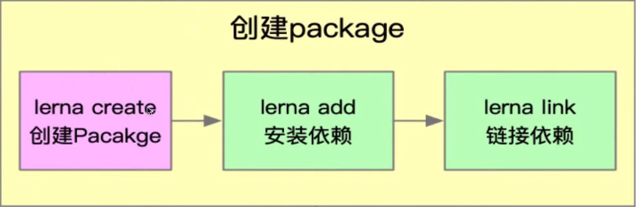

#### Lerna简介

lerna 是一个优化基于git+npm的多package项目的管理工具

#### 优势
- 大幅减少重复操作
- 提升操作的标准化

#### lerna开发脚手架流程

- 脚手架项目初始化   
> 初始化npm项目 -> 安装lerna -> lerna init 初始化项目   
   
  

- 创建package 
> lerna create 创建 Package -> lerna add 安装依赖  -> lerna link 链接依赖   
   
  

- 脚手架开发和测试 
> lerna exec 执行 shell 脚本 -> lerna run 执行 npm 命令 -> lerna clean 清空依赖 -> lerna bootstrap 重装依赖 
   
  

- 脚手架发布上线 
> lerna version  , bump version -> lerna changed 查看上版本依赖的所有变更 -> lerna diff 查看 diff -> lerna publish 项目发布  
   
   

