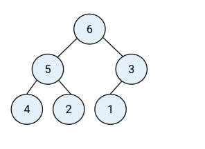
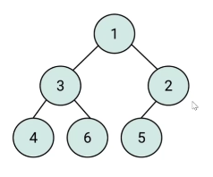
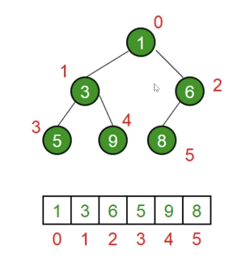

## 堆
- 概念   

> 堆是一种特殊的`完全二叉树`；   
> 所有的节点都大于等于（最大堆）或者小于等于（最小堆）它的子节点； 

- 最大堆  

    

- 最小堆  

    


## JS中的堆 
> JS 中通常用数组表示堆。  

- 一些方法  

> 任意左侧子节点的位置是 `2*index + 1`；  
> 任意右节点的位置是 `2*index + 2`；
> 父节点的位置是 `(index - 1)/2` 的商； 

   

## 堆的应用 

- 堆能高效、快速地找出最大值和最小值，时间复杂度：O(1)； 
- 找出第 K 个最大（小）元素； 


## JavaScript实现：最小堆类 

- 插入  

> 将值插入堆的底部，即数组的尾部； 
> 然后上移：将这个值和它的父节点进行交换，直到父节点小于等于这个插入的值； 
> 大小为k的堆中删除堆顶的时间复杂度为`O(logK)`； 

- 删除堆顶   

> 用数组尾部元素替换堆顶（直接删除堆顶会破坏堆结构）；  
> 然后下移：将新堆顶和它的子节点进行交换，直到子节点大于等于这个新堆顶；  
> 大小为k的堆中删除堆顶的时间复杂度为`O(logK)`；  

- 获取堆顶和堆的大小  

> 获取堆顶：返回数组的头部； 
> 获取堆的大小：返回数组的长度； 

```javascript
class MinHeap {
    constructor(){
        this.heap = []
    }
    // 插入堆
    insert(val){
        this.heap.push(val);
        this.shiftUp(this.heap.length - 1);
    }
    // 删除堆顶
    pop(){
        this.head[0] = this.head.pop();
        this.shiftDown(0)
    }
    // 获取堆顶
    peek(){
        return this.heap[0]
    }
    // 获取堆大小
    size(){
        return this.heap.length
    }
    getParentIndex(index){
        // Math.floor((index -1 )/2)
        return (index - 1) >> 1
    }
    swap(i1,i2){
        const tmp = this.heap[i1];
        this.heap[i1] = this.heap[i2];
        this.heap[i2] = tmp;
    }
    getLeft(index){
        return index*2 + 1
    }
    getRight(index){
        return index*2 + 2
    }
    shiftDown(index){
        const left = this.getLeft(index);
        const right = this.getRight(index);
        if(this.heap[left] < this.heap[index]){
            this.swap(left,index);
            this.shiftDown(left)
        }
        if(this.heap[right] < this.heap[index]){
            this.swap(right,index);
            this.shiftDown(right)
        }
    }
    shiftUp(index){
        if(index === 0) return;
        const pIndex = this.getParentIndex(index);
        if(this.heap[pIndex] > this.heap[index]){
            this.swap(pIndex,index)
            this.shiftUp(pIndex);
        }
    }
}

```   


## 实例题  

### 数组中的第K个最大元素      

- 题目 力扣 215  
### 前K个高频元素      

- 题目 力扣 347  
### 合并K个排序链表      

- 题目 力扣 23  