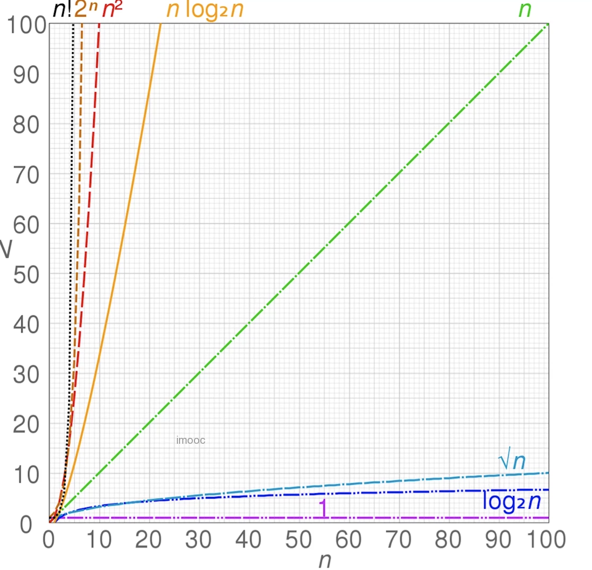

## 基本概念
- 数据结构   

> 计算机存储、组织数据的方式；  

- 算法    

> 一系列解决问题的清晰指令；  
> 程序 = 数据结构 + 算法 ； 数据结构为算法提供服务，算法围绕数据结构操作；  


## 常见数据结构   
- 有顺序    

> 栈、队列、链表  

- 无序    

> 集合、字典  

- 层级    

> 树、堆、图  

## 时间复杂度计算 

- 概念    

> 一个函数，用大o表示，比如：O(1)、O(n)、O(logN)... ； 定性描述该算法的运行时间    

- 时间复杂度图     

    

- 时间复杂度代码示例    

> O(1)    

```javascript 
let i = 0 ;
i+= 1;
```   

> O(n)    

```javascript 
for(let i = 0; i< n; i+1>){
    console.log(i)
}
```    

> O(1) + O(n) = O(n)    

```javascript 
let i = 0 ;
i+= 1;
for(let j = 0; j< n; j+1>){
    console.log(j)
}
```    

> O(n)*O(n) = O(n^2)  

```javascript 
for(let i = 0; i< n; i+1>){
for(let j = 0; j< n; j+1>){
    console.log(j)
}
}
```   

> O(logN)   

```javascript 
let i = 1;
while (i < n) {
    console.log(i);
    i *= 2
}
```    

## 空间复杂度  
- 概念   

> 一个函数，用大O表示，比如：O(1)、O(n)、O(logN)... ；算法在运行过程中临时占用存储空间大小的量度  


- 空间复杂度代码示例     

> O(1)   

```javascript 
let i = 0 ;  //单个变量
i+= 1;
```  

> O(n)   

```javascript  
let list = []
for(let i = 0; i< n; i+1>){
    list.push(i)
}
```   


>  O(n^2)   

```javascript 
const matrix = [];
for(let i = 0; i< n; i+1>){
     matrix.push([])
    for(let j = 0; j< n; j+1>){
        matrix.push([i]).push(j)
    }
}
```   


