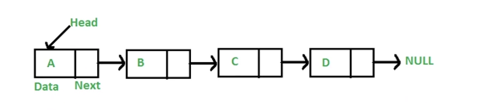

## 链表
- 概念   
> 多个元素组成的列表；   
> 元素存储不连续，用next指针连在一起；     
        

## 数组 vs  链表  
> 数组：增删非首尾元素时往往需要移动元素。  
> 链表：增删非首尾元素，不需要移动元素，只需要更改 next 的指向即可。  

## JS 的链表  
> javaScript 中无链表。  
> 可以用 Object 模拟链表。  


## 前端与链表 

### JS中的原型链   
> 原型链的本质就是链表；  
> 原型链上的节点是各种原型对象，比如：Function.prototype、Object.prototype ...  
> 原型链通过 __proto__ 属性连接各种原型对象；    

- 如果A沿着原型链能够找到 B.prototype , 那么 A instanceof B为 true； 
- 如果在A对象没有找到X属性，那么就会沿着原型链上找X属性；  

### 使用链表指针获取JSON的节点值  

```javascript
const json = {
    a : {b : { c  :1}}
};
const path = ['a','b','c'];
let p = json;
path.forEach(key => {
    p = p[key]
});

```

### 相关面试  

- instanceof的原理，并用代码实现    

```javascript

const instanceof = (a , b) => {
    let p = a;
    while(p){
        if(p === b.prototype){
            return true;
        }
        p = p.__proto__;
    }
    return false
}
let arr = []
instanceof(arr,Object)


```


## 实例题  

### 删除节点 
- 解题思路   

> 1.无法操作被删除节点的上个节点直接指向被操作节点的下个节点，所以只能是基于被删除节点和下个节点进行操作；   
> 2.将被删除节点的下个节点的值替换当前被删除节点的值；  
> 3.将被删除节点的下个节点的next 替换被删除节点的 next； 
- 题目 力扣 933

### 反转链表  
- 解题思路   
> 1.先去思考如何反转两个节点：将n+1 的 next 指向 n；  
> 2.反转多个节点：双指针遍历链表，重复上面操作；  
- 解题步骤   
> 1.双指针一前一后遍历链表； 
> 2.反转双指针；  
- 题目 力扣 206  

### 两数相加  

- 题目 力扣 2 

### 删除排序链表中的重复元素 
- 题目 力扣 83  


### 环形链表 
- 题目 力扣 141  
