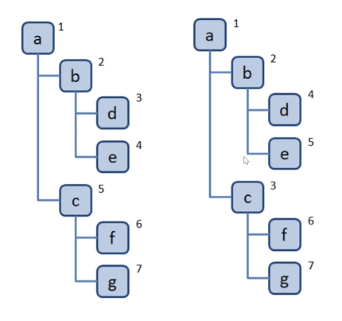
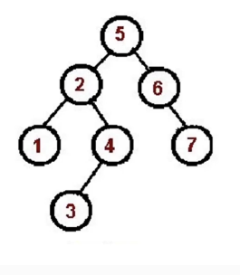
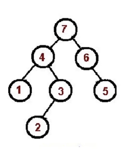

## 集合
- 概念   

> 一种 分层 数据的抽象模型；如：DOM树、级联选择、树形控件... ...  
> 树常用操作：深度/广度优先遍历、先中后序遍历 

## 深度/广度优先遍历 
- 深度优先    

> 尽可能深的搜索树的分支；  
> 类似于书一页一页翻看； 
> 1.访问根节点； 2.对根节点的children挨个进行深度优先遍历；    

```javascript
const dfs = (root) => {
    console.log(root.val)
    root.children.forEach(dfs)
}

```

 
- 广度优先   

> 先访问离根节点最近的节点； 
> 类似于书先看目录，再看每个章节；    
> 1.新建一个队列，把根节点入队；2.把队头出队并访问；3.把队头的children挨个排队；4.重复 2，3 直到队列为空；   

```javascript
const bfs = (root) => {
    const q = [root];
    while(q.lenght > 0) {
        const n = q.shift;
        console.log(n.val)
        n.children.forEach(item => {
            q.push(item);
        })
    }
}

```   

     

## 二叉树：先/中/后序遍历  
- 概念   

> 树的每个节点最多只能有两个子节点；  
> 在js中一般用Object来模拟二叉树；   

- 示例     

```javascript
const binaryTree  = {
    val : 1,
    left : {
        val : 2 ,
        left : null,
        right : null
    },
    right : {
        val : 2 ,
        left : null,
        right : null
    },
}
``` 

### 先序遍历  

> 1.访问 根 节点； 
> 2.对根节点的 左 子树 进行先序遍历； 
> 3.对根节点的 右 子树 进行先序遍历；    

     

### 中序遍历  

> 1.对根节点的 左 子树 进行先序遍历； 
> 2.访问 根 节点； 
> 3.对根节点的 右 子树 进行先序遍历；    

     

### 后序遍历  

> 1.对根节点的 左 子树 进行先序遍历； 
> 2.对根节点的 右 子树 进行先序遍历； 
> 3.访问 根 节点；     

      

## 二叉树：先/中/后序遍历(非递归版)   


### 先序遍历   

```javascript  
const preorder = (root) => {
    if(!root) return;
    const stack = [root];
    while(stack.length){
        const n = stack.pop();
        console.log(n.val);
        if(n.right) stack.push(n.right);
        if(n.left) stack.push(n.left);
    }
}
```

### 中序遍历  

```javascript  
const preorder = (root) => {
    if(!root) return;
    const stack = [];
    const p = root;
    while(stack.length || p){
        while(p){
            stack.push(p)
            p.p.left;  
        }
        const n = stack.pop();
        console.log(n.val);
        p = p.right;
    }
}
```

### 后序遍历  

```javascript  
const preorder = (root) => {
    if(!root) return;
    const output = []
    const stack = [root];
    while(stack.length){
        const n = stack.pop();
        output.push(n)
        if(n.left) stack.push(n.left);
        if(n.right) stack.push(n.right);
    }
    while(output.length){
        const n = output.pop();
        console.log(n.val);
    }
}
```  


## 实例题  

### 二叉树的最大深度      

- 题目 力扣 104  