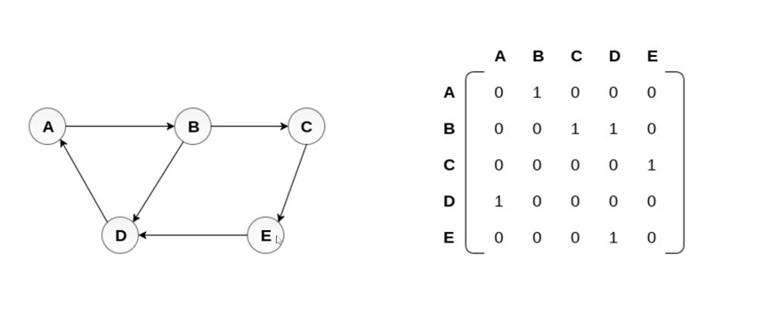
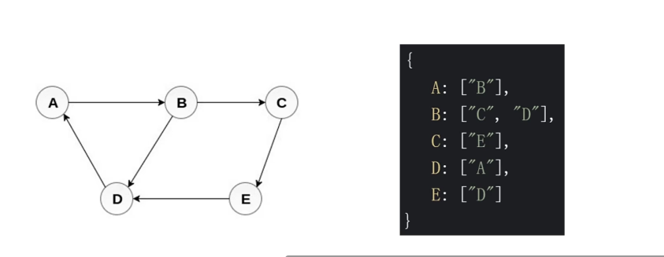

## 图
- 概念   
> 图是 网络结构 的抽象模型，是一种由 边 连接的节点； 
> 图可以表示任何 二元 关系，比如道路、航班... ...； 
> JS 中没有图，但是可以用 Object 和 Array 构建图；  
> 图的表示法：邻接矩阵、邻接表、关联矩阵... ... ；  

## 表示法 

- 邻接矩阵    

    

- 邻接表    

    

## 图的常用操作  
 
- 深度优先   

- 广度优先   