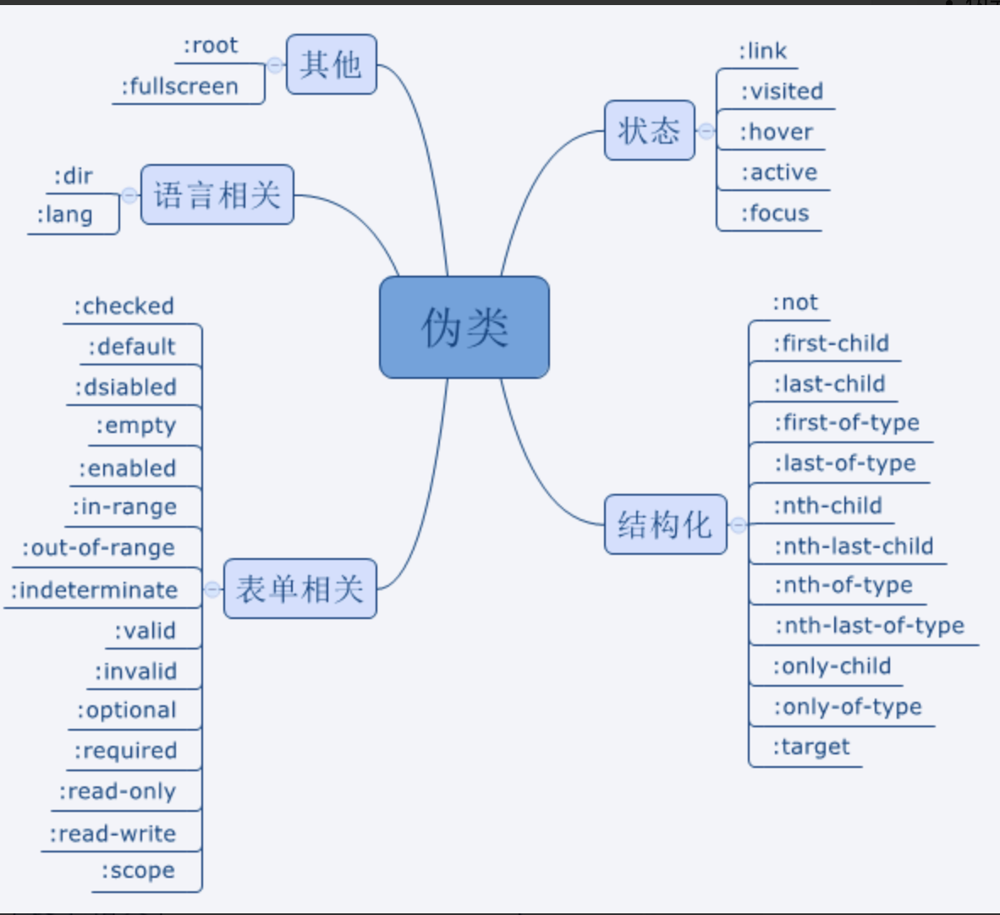

###### 伪类和伪元素



- 伪元素
> 用于创建不在文档中的元素，并未其添加样式；如： ::before 等； 一般为双冒号用来区分伪类和伪元素，但是浏览器对于单冒号的伪元素也是支持的；

- 伪类
> 本质为css选择器；主要为：用户行为等自动添加的样式提供可供css选择的样式控制；如：:hover

###### 如何实现 宽高比为4 :3 的div
> 利用padding ， 当 margin padding left/top 取值百分比，以父级div 的宽度计算；


###### 什么是margin重叠
> 相邻元素margin 重叠 ， 父子元素margin 重叠；

```javascript
如果都是正边界，结果的边界宽度是相邻边界宽度中最大的值
如果出现负边界，则在最大的正边界中减去绝对值最大的负边界
如果没有正边界，则从零中减去绝对值最大的负边界
```

###### flex
> flex : inital  => 0 1 auto ; auto => 1 1 auto ; none => 0 0 auto;
> flex : 1  => 1 1 auto;

###### 圣杯布局 双飞翼布局
> flex grid  floa  absolute

###### @import link 区别
> 加载时机
> 引入类型


###### positon : absolute 定位原点
> 不设置left top ， 以祖先元素中position中static中的第一个元素的content位置为起始位置，如果设置left 0 top 0 以padding 为起始位置；


###### 绝对定位元素与非绝对定位元素的百分比计算的区别
> 绝对定位元素的宽高百分比是相对于临近的position不为static的祖先元素的paddingbox来计算的。
非绝对定位元素的宽高百分比则是相对于父元素的contentbox来计算的。

###### 元素竖向的百分比设定是相对于容器的高度吗？
> 如果是height的话，是相对于包含块的高度。
> 如果是padding或者margin竖直方向的属性则是相对于包含块的宽度。


- [掘金](https://juejin.cn/post/6844904117819850765)
- [腾讯云](https://cloud.tencent.com/developer/article/1608771)


