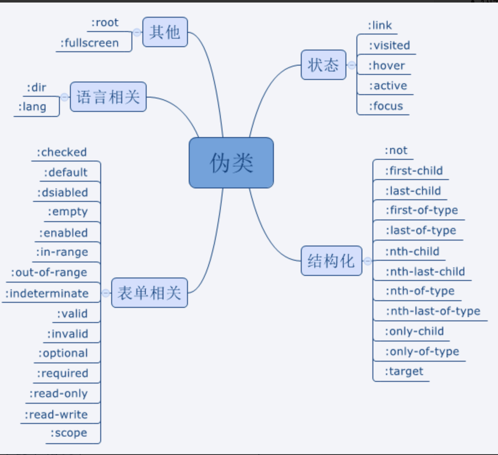

## 伪类和伪元素

- 伪元素
> 用于创建不在文档中的元素，并未其添加样式；如： ::before 等； 一般为双冒号用来区分伪类和伪元素，但是浏览器对于单冒号的伪元素也是支持的；

- 伪类
> 本质为css选择器；主要为：用户行为等自动添加的样式提供可供css选择的样式控制；如：:hover

## 如何实现 宽高比为4 :3 的div

> [!TIP|style:flat]
> 利用padding ， 当 margin padding left/top 取值百分比，以父级div 的宽度计算；

## 什么是margin重叠

> [!TIP|style:flat]
> 相邻元素margin 重叠 ， 父子元素margin 重叠；     
   
---
    
> [!DANGER|style:flat]
> 如果都是正边界，结果的边界宽度是相邻边界宽度中最大的值  
> 如果出现负边界，则在最大的正边界中减去绝对值最大的负边界  
> 如果没有正边界，则从零中减去绝对值最大的负边界  

## flex
> flex : inital  => 0 1 auto ; auto => 1 1 auto ; none => 0 0 auto;  
> flex : 1  => 1 1 auto; => flex-grow flex-shrink flex-basis;   

## 圣杯布局 双飞翼布局   

> [!TIP|style:flat]
> flex grid  floa  absolute

## @import link 区别
> 加载时机： link 解析到加载， @import 页面加载后加载；
> 引入类型： link 可加载其他，@import 只适用于css；
> 权重： link权重大于@import，@import引入的css 会置于顶部，如果样式有重复则@import中样式不会生效；
> 可通过dom控制： link可以通过js中dom接口动态插入，@import则不可以；

## positon : absolute 定位原点
> 不设置left top ， 以祖先元素中position中static中的第一个元素的content位置为起始位置，如果设置left 0 top 0 以padding 为起始位置；

## 绝对定位元素与非绝对定位元素的百分比计算的区别
> 绝对定位元素的宽高百分比是相对于临近的position不为static的祖先元素的paddingbox来计算的。
非绝对定位元素的宽高百分比则是相对于父元素的contentbox来计算的。

## 元素竖向的百分比设定是相对于容器的高度吗？
> 如果是height的话，是相对于包含块的高度。
> 如果是padding或者margin竖直方向的属性则是相对于包含块的宽度。  

## BFC 
- 概念  
> 格式化上下文, 它是页面中的一块渲染区域,并且有一套渲染规则,它决定了其子元素将如何定位,以及和其他元素的关系和相互渲染作用  
> BFC 即 Block Formatting Contexts (块级格式化上下文)，它属于上述定位方案的普通流。  

- 触发BFC   
> 根元素(<html>) 
> 浮动元素（元素的 float 不是 none）  
> 绝对定位元素（元素的 position 为 absolute 或 fixed） 
> 行内块元素（元素的 display 为 inline-block） 
> overflow 值不为 visible 的块元素  

## 渲染过程

> [!NOTE|style:flat]
- dom tree   
- css tree    
- layout   
- paint   
- compositing

## css解析规则为何是从右到左
> 因为选择器在进行匹配时需要遍历查找，而失败的查找会造成回溯重新遍历，从左到右会有大量失败的回溯，就造成时间的浪费和性能问题；

## 参考文章
- [CSS知识点整理](https://juejin.cn/post/6844904117819850765)
- [104道CSS面试题](https://cloud.tencent.com/developer/article/1608771)
- [Flex布局教程：语法篇](https://www.ruanyifeng.com/blog/2015/07/flex-grammar.html)
- [圣杯布局和双飞翼布局](https://www.jianshu.com/p/81ef7e7094e8)

