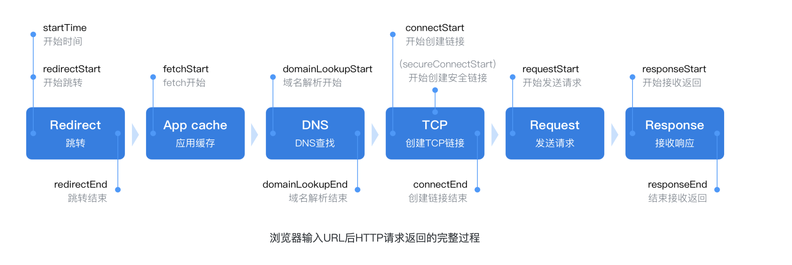
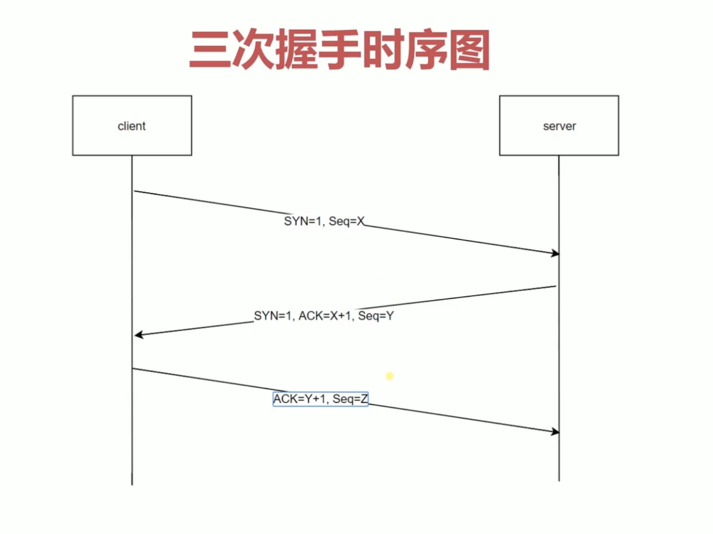
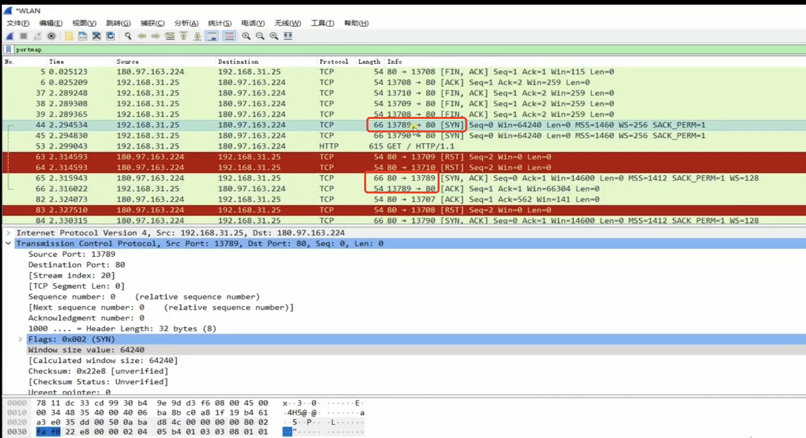
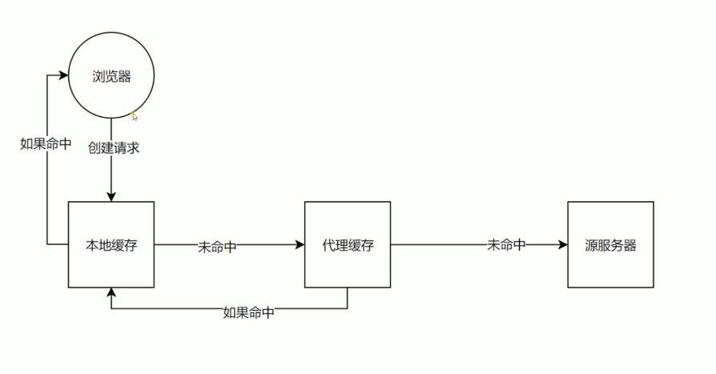

## http介绍

### http概念
> HTTP 是一个在计算机世界里专门在「两点」之间「传输」文字、图片、音频、视频等「超文本」数据的「约定和规范」。   

### url到页面过程  
    


> [!NOTE|style:flat]
> 为什么一开始就进行redirect？  
> 浏览器可能已经记住当前地址被永久重定向，所以浏览器一开始需要判断是否需要redirect以及redirect到哪里。  
> APP cache  
> 可能当前请求的资源已经被缓存过了。    

### TCP 三次握手  
   
    

> [!NOTE|style:flat]
> 为什么需要三次握手？ 
> tcp连接是个消耗性能过程，同时受网络状况的限制，假如发送req时服务端开启端口同时给与响应，  
> 但是受网络因素影响，包丢失或者延迟，客户端接收失败超时就会导致客户端会重新发送一个请求，  
> 而此时服务端并不知道客户端是否接受成功，那么就不知道开启服务还是关闭服务，端口一直开启中，开销浪费。  
> 为了规避建立连接过程中，因为网络因素导致的服务器开销浪费问题。   

### TCP 四次挥手   


### URI URL URN  
- URI  
> 统一资源标识符，用来唯一标识互联网上的信息资源，包括URL、URN。  

- URL 
> 统一资源定位器。  

- URN 
> 永久统一资源定位符   


### http状态码


> [!NOTE|style:flat]
> 3xx 类状态码表示客户端请求的资源发送了变动，需要客户端用新的 URL 重新发送请求获取资源，也就是重定向。    
> 「301 Moved Permanently」（status code : 302 Found (from disk cache)）表示永久重定向，说明请求的资源已经不存在了，需改用新的 URL 再次访问。  
> 「302 Found」 （status code : 302 Found (from disk cache)）表示临时重定向，说明请求的资源还在，但暂时需要用另一个 URL 来访问。  
> 301 和 302 都会在响应头里使用字段 Location，指明后续要跳转的 URL，浏览器会自动重定向新的 URL。   
> 「304 Not Modified」不具有跳转的含义，表示资源未修改，重定向已存在的缓冲文件，也称缓存重定向，用于缓存控制。  

```javascript
http.createServer(function (request, response) {
  console.log('request come', request.url)

  if (request.url === '/') {
    /**
     * code 为 200时，不会重定向到/new 只有 302 301 状态码才会。
     * code 为 302时，每次访问/都会经过服务端 然后进行重定向。
     * code 为 301时，浏览器在访问/时不需要经过服务器而是直接定向到301，慎重使用，
     * 因为使用301后，浏览器会将 / -> /new 缓存到浏览器端，哪怕服务端更改了其他code，
     * 浏览器也无法感知，除非用户的浏览器重新清掉缓存。
     * */ 
    response.writeHead(302, {  // or 301
      'Location': '/new'
    })
    response.end()
  }
  if (request.url === '/new') {
    response.writeHead(200, {
      'Content-Type': 'text/html',
    })
    response.end('<div>this is content</div>')
  }
}).listen(8888)
```

### http发展 

- http/1.0 每次请求需要重新建立连接
- http/1.1 长连接，但是会服务端队头阻塞
- http/2.0 解决了队头阻塞，但是会发生丢包重传（信道复用，分帧传输，serve push）
- http/3.0 基于tcp的udp改良的QUIC连接；  


## 资源获取流程  
  
## http缓存


### 缓存分类
- 强制缓存


- 协商缓存


  


> [!DANGER|style:flat]
> 如果使用了强制缓存，并且未达到过期时间，那么客户端不再和服务端发生交互，此时是浏览器自身的缓存，此间如果资源发生修改也不会重新获取，有效期内 返回状态码为 200 （from memory）， 如果达到过期时间再去服务端拿 服务端返回未过期 返回 304  从缓存中直接拿取；  
> 如果使用了协商缓存，每次请求资源都会走服务器进行对比，如果资源未过期 返回状态码 304 ，如果资源已经过期返回最新资源且返回新的资源标识和时间；    

```javascript
  if (request.url === '/script.js') {
    const etag = request.headers['if-none-match']  //获取last-modified 对应的header
    /**
     * 服务端进行etag验证，如果etag为：777 那么返回状态码为：304，此时从浏览器中读取缓存数据
     * 
     * */ 
    if (etag === '777') {
      response.writeHead(304, {
        'Content-Type': 'text/javascript',
        /***
         * max-age=5 , s-maxage=20 在5秒内走的是浏览器缓存，在5-20秒内走的时候代理服务器缓存（如：其他用户访问相同链接
         *  获取资源也很快，因为存在代理服务器缓存）；
         * max-age=5 , s-maxage=20 , private 在5秒内走的是浏览器缓存，在大于5秒不走缓存
         *   （private 只有浏览器才可以缓存，代理服务器不允许缓存）；
         * max-age=5 , s-maxage=20 , no-store  都不走缓存 （no-store 浏览器，代理服务器都不缓存）
         * */ 
        'Cache-Control': 'max-age=2000000, no-cache',    
        'Last-Modified': '123',
        'Etag': '777'
      })
    /**
     * 返回304时，此时end中的任何内容都不会返回，因为返回304状态码，那么就会从浏览器中读取缓存的上次的response.end内容
     * */   
      response.end()
    } else {
      response.writeHead(200, {
        'Content-Type': 'text/javascript',
        /**
         * max-age 代表 2000000秒 内进行缓存，（如果是：'Cache-Control': 'max-age=2000000', 代表强制缓存；浏览器自身的缓存，如果* * max-age时间内服务端资源发生修改也不会重新获取。（200 from memory）刷新浏览器缓存解决方式：通过webpack对文件增加hash）
         * no-cache 代表虽然进行缓存，但是都需要走服务端进行验证，
         * */ 
        'Cache-Control': 'max-age=2000000, no-cache', 
        'Last-Modified': '123',
        'Etag': '777'
      })
      response.end('console.log("script loaded twice")')
    }
  }
}).listen(8888) 
```

### 缓存优先级 
> 强缓存优先级大于协商缓存

### 缓存对比

> [!NOTE|style:flat]
- http/1.0
> 通过过期时间：Expires， 服务器时间和客户端时间不一致会出问题；  

---

> [!NOTE|style:flat]
- http/1.1
> 通过cache-control、eTag、last-modified 对比
> last-modified 只能到秒级，而且只要文件只要有保存那么时间就会被修改，一个是时间维度不够，一个修改缺乏准确性，所以出现了eTag；

- 对比：


### 前端如何设置缓存
```html
一般需要缓存的资源有html页面和其他静态资源：

1、html页面缓存的设置主要是在<head>标签中嵌入<meta>标签，这种方式只对页面有效，对页面上的资源无效

1.1、html页面禁用缓存的设置如下：
<meta http-equiv="pragma" content="no-cache">
// 仅有IE浏览器才识别的标签，不一定会在请求字段加上Pragma，但的确会让当前页面每次都发新请求

<meta http-equiv="cache-control" content="no-cache">
// 其他主流浏览器识别的标签

<meta http-equiv="expires" content="0">
// 仅有IE浏览器才识别的标签，该方式仅仅作为知会IE缓存时间的标记，你并不能在请求或响应报文中找到Expires字段

1.2、html设置缓存如下：
<meta http-equiv="Cache-Control" content="max-age=7200" />
// 其他主流浏览器识别的标签

<meta http-equiv="Expires" content="Mon, 20 Aug 2018 23:00:00 GMT" />
// 仅有IE浏览器才识别的标签

2、静态资源的缓存一般是在web服务器上配置的，常用的web服务器有：nginx、apache。具体的配置这里不做详细介绍，大家自行查阅。
```


  

## 本地缓存
![本地缓存]](../../assets/http/本地缓存.jpg)  

- Cookie 
> max-age和expires设置过期时间；  
> Secure只再https的时候发送；  
> HttpOnly无法通过document.cookie访问； 


## 网络安全

### 1XSS

### CSRF

### SQL注入攻击  


###  CORS  
> 该策略是浏览器的策略，不存在于服务端之间请求或者终端命令http请求当中，当一个请求从客户端发出的时候，  
> 如果命中CORS策略并且后端未设置 Access-Control-Allow-Origin  时浏览器会将服务端的返回给屏蔽掉，  
> 同时在控制台输出CORS的error，该行为是浏览器同源策略行为。     

```javascript
const http = require('http')
http.createServer(function (request, response) {
  console.log('request come', request.url)
  response.writeHead(200, {
    'Access-Control-Allow-Origin': 'http://127.0.0.1:8888',
    /**
     * 允许请求携带的headers的key，此时预请求可以通过。
     * */ 
    'Access-Control-Allow-Headers': 'X-Test-Cors',
    /**
     * 允许的预请求的method，此时预请求可以通过。
     * */ 
    'Access-Control-Allow-Methods': 'POST, PUT, DELETE',
    /**
     * 该请求方式下此时间范围（1000秒）不需要进行验证，即在该时间范围内所有符合条件的预请求都放过不需要进行验证，对应http在该时间范围内都没有* options的预请求。
     * */ 
    'Access-Control-Max-Age': '1000'
  })
  response.end('123')
}).listen(8887)

```

## 常见问题汇总

### 1GET和POST方法都是安全和幂等的吗

> [!NOTE|style:flat]
> 在 HTTP 协议里，所谓的「安全」是指请求方法不会「破坏」服务器上的资源。
所谓的「幂等」，意思是多次执行相同的操作，结果都是「相同」的。

- GET 方法就是安全且幂等的，因为它是「只读」操作，无论操作多少次，服务器上的数据都是安全的，且每次的结果都是相同的。
- POST 因为是「新增或提交数据」的操作，会修改服务器上的资源，所以是不安全的，且多次提交数据就会创建多个资源，所以不是幂等的。


## 工具类  
- hotsadmin   
> 可以将本地服务如：127.0.0.7 映射为 ： xxx.xxx.com，同时chrome可以支持该域名访问服务。   

## 参考文章
- [硬核！30 张图解 HTTP 常见的面试题](https://www.cnblogs.com/xiaolincoding/p/12442435.html)
- [深入理解HTTP缓存机制及原理](https://juejin.cn/post/6844903801778864136)
- [一文读懂http缓存（超详细）](https://www.jianshu.com/p/227cee9c8d15)
- [Content Security Policy 入门教程](http://www.ruanyifeng.com/blog/2016/09/csp.html)
- [常见 Web 安全攻防](https://github.com/gauseen/blog/issues/12)