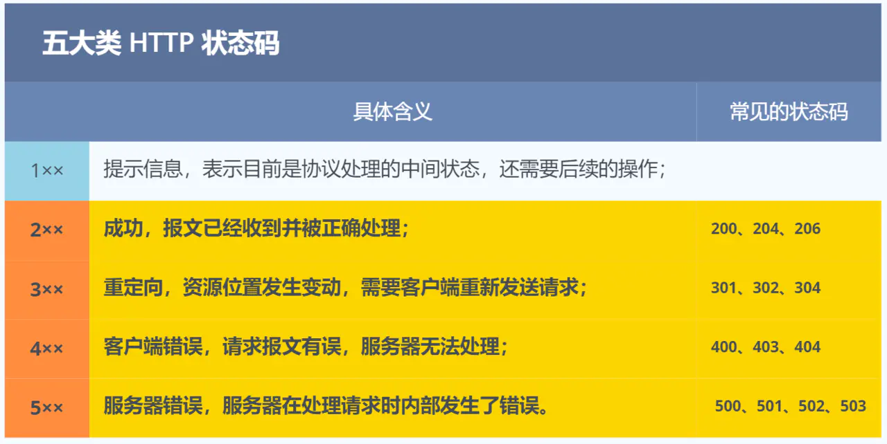
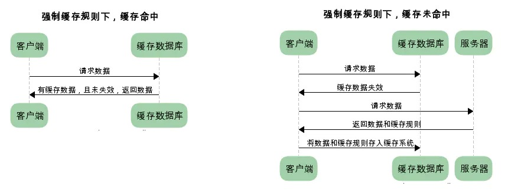
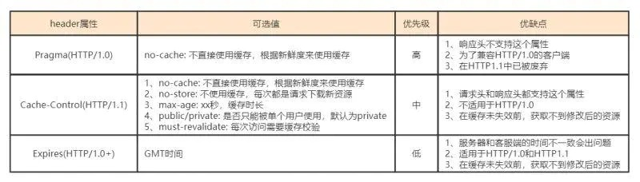
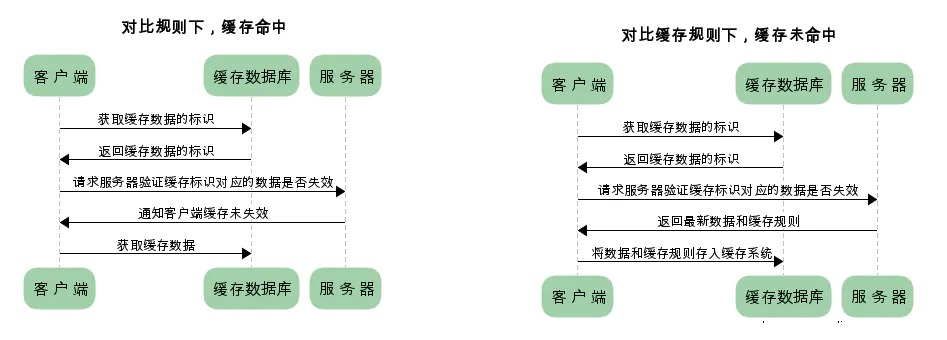
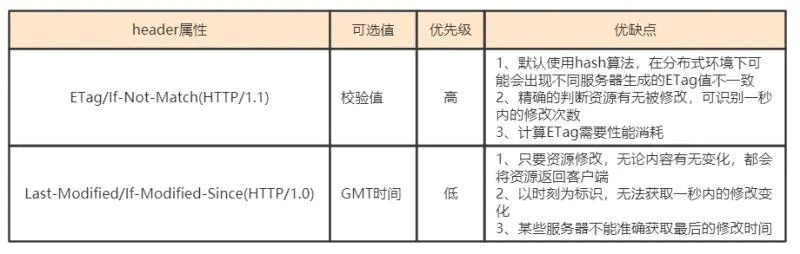
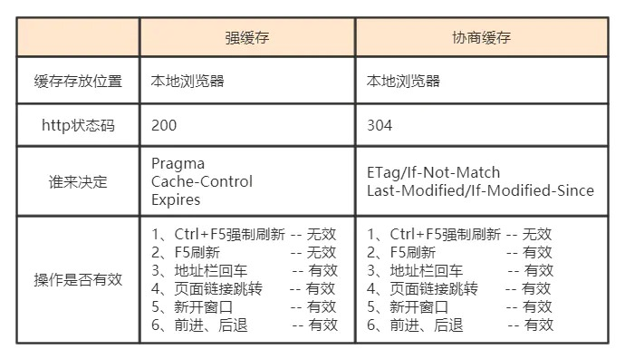
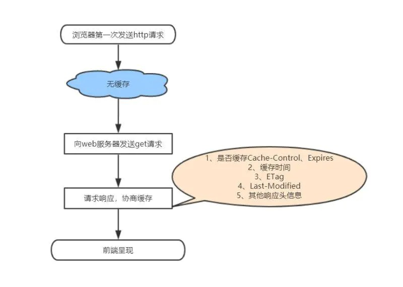
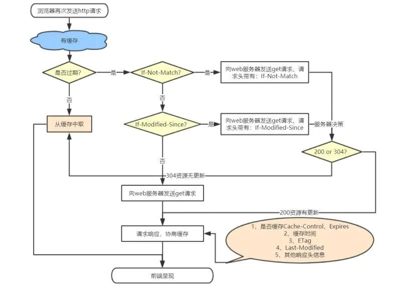

`<!-- toc -->`

# http介绍

## http概念
> HTTP 是一个在计算机世界里专门在「两点」之间「传输」文字、图片、音频、视频等「超文本」数据的「约定和规范」。 

## http状态码


 - 3xx 
 > 3xx 类状态码表示客户端请求的资源发送了变动，需要客户端用新的 URL 重新发送请求获取资源，也就是重定向。  
 ---
 > 「301 Moved Permanently」表示永久重定向，说明请求的资源已经不存在了，需改用新的 URL 再次访问。  
 > 「302 Found」表示临时重定向，说明请求的资源还在，但暂时需要用另一个 URL 来访问。  
 > 301 和 302 都会在响应头里使用字段 Location，指明后续要跳转的 URL，浏览器会自动重定向新的 URL。     
 ---
 > 「304 Not Modified」不具有跳转的含义，表示资源未修改，重定向已存在的缓冲文件，也称缓存重定向，用于缓存控制。

## http发展 
- http/1.0 每次请求需要重新建立连接
- http/1.1 长连接，但是会服务端队头阻塞
- http/2.0 解决了队头阻塞，但是会发生丢包重传
- http/3.0 基于tcp的udp改良的QUIC连接；

# http缓存


## 缓存分类
- 强制缓存





- 协商缓存






> 如果使用了强制缓存，并且未达到过期时间，那么客户端不再和服务端发生交互，此间如果资源发生修改也不会重新获取，有效期内 返回状态码为 200 ， 如果达到过期时间再去服务端拿 服务端返回未过期 返回 304  从缓存中直接拿取；  
> 如果使用了协商缓存，每次请求资源都会走服务器进行对比，如果资源未过期 返回状态码 304 ，如果资源已经过期返回最新资源且返回新的资源标识和时间；


## 缓存优先级
> 强缓存优先级大于协商缓存

## 缓存对比
- http/1.0
> 通过过期时间：Expires， 服务器时间和客户端时间不一致会出问题；

- http/1.1
> 通过cache-control、eTag、last-modified 对比

> last-modified 只能到秒级，而且只要文件只要有保存那么时间就会被修改，一个是时间维度不够，一个修改缺乏准确性，所以出现了eTag；

对比：


## 前端如何设置缓存
```html
一般需要缓存的资源有html页面和其他静态资源：

1、html页面缓存的设置主要是在<head>标签中嵌入<meta>标签，这种方式只对页面有效，对页面上的资源无效

1.1、html页面禁用缓存的设置如下：
<meta http-equiv="pragma" content="no-cache">
// 仅有IE浏览器才识别的标签，不一定会在请求字段加上Pragma，但的确会让当前页面每次都发新请求

<meta http-equiv="cache-control" content="no-cache">
// 其他主流浏览器识别的标签

<meta http-equiv="expires" content="0">
// 仅有IE浏览器才识别的标签，该方式仅仅作为知会IE缓存时间的标记，你并不能在请求或响应报文中找到Expires字段

1.2、html设置缓存如下：
<meta http-equiv="Cache-Control" content="max-age=7200" />
// 其他主流浏览器识别的标签

<meta http-equiv="Expires" content="Mon, 20 Aug 2018 23:00:00 GMT" />
// 仅有IE浏览器才识别的标签

2、静态资源的缓存一般是在web服务器上配置的，常用的web服务器有：nginx、apache。具体的配置这里不做详细介绍，大家自行查阅。
```





# 本地缓存
![本地缓存]](../../assets/http/本地缓存.jpg)


# 网络安全

## XSS

## CSRF

## SQL注入攻击

# 常见问题汇总

## GET和POST方法都是安全和幂等的吗

> 在 HTTP 协议里，所谓的「安全」是指请求方法不会「破坏」服务器上的资源。
所谓的「幂等」，意思是多次执行相同的操作，结果都是「相同」的。

- GET 方法就是安全且幂等的，因为它是「只读」操作，无论操作多少次，服务器上的数据都是安全的，且每次的结果都是相同的。
- POST 因为是「新增或提交数据」的操作，会修改服务器上的资源，所以是不安全的，且多次提交数据就会创建多个资源，所以不是幂等的。

# 参考文章
- [硬核！30 张图解 HTTP 常见的面试题](https://www.cnblogs.com/xiaolincoding/p/12442435.html)
- [深入理解HTTP缓存机制及原理](https://juejin.cn/post/6844903801778864136)
- [一文读懂http缓存（超详细）](https://www.jianshu.com/p/227cee9c8d15)
- [Content Security Policy 入门教程](http://www.ruanyifeng.com/blog/2016/09/csp.html)