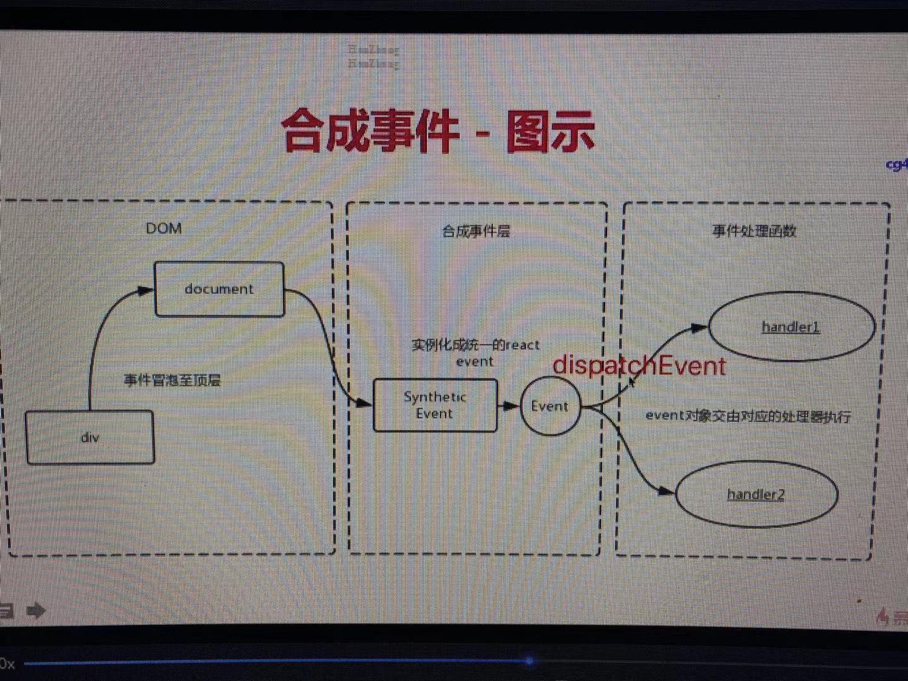
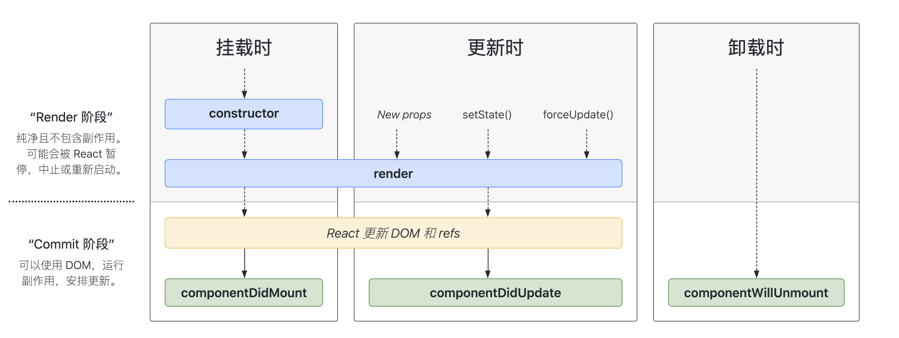
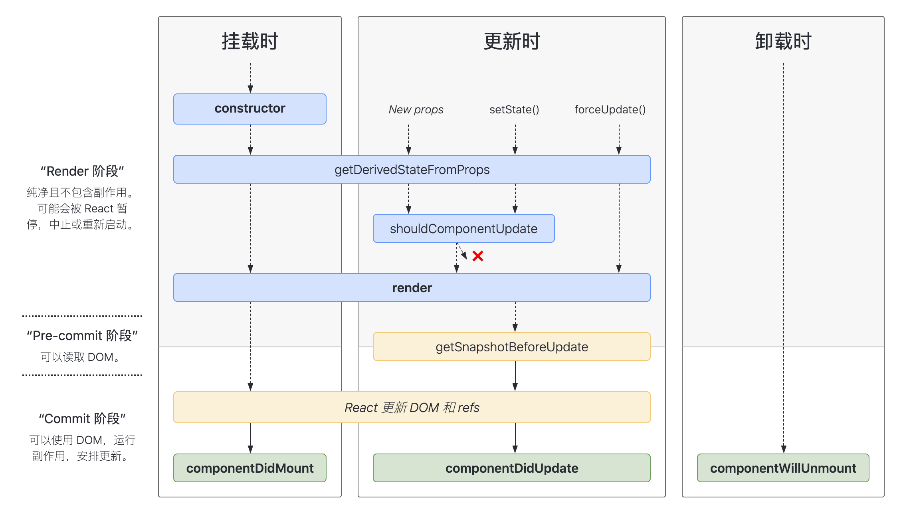
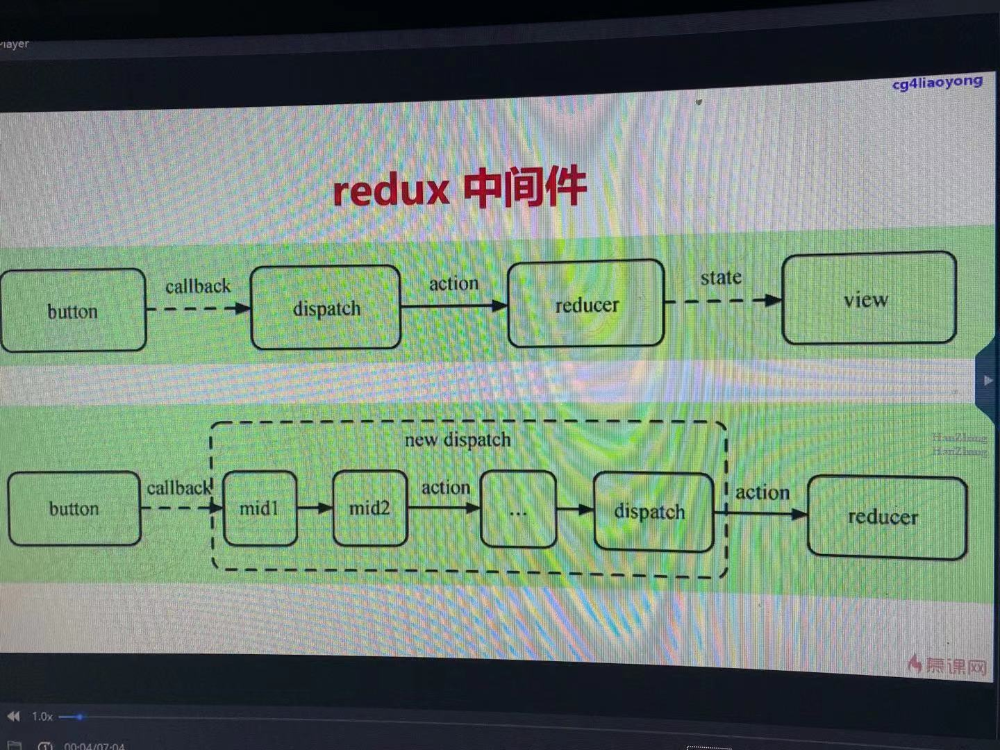
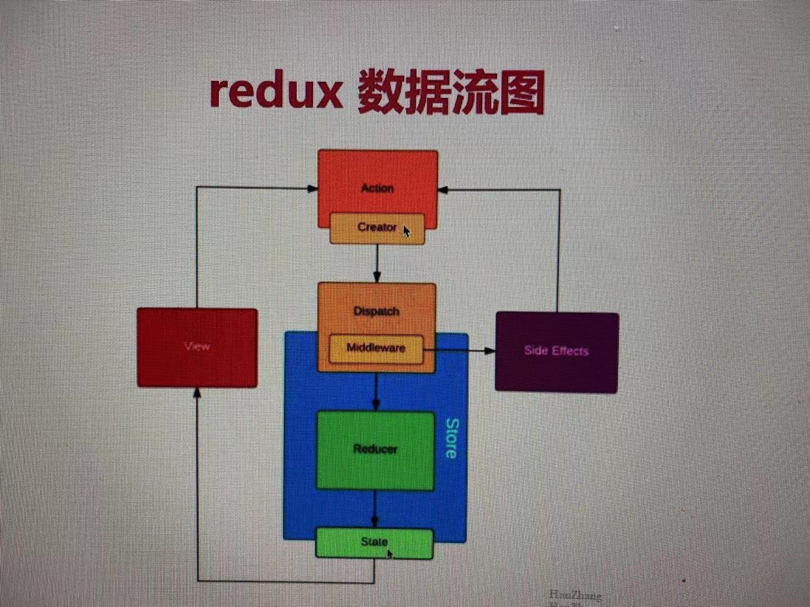

## React Class 组件

### super函数


### 绑定this方法

- this.a = this.a.bind(this)
- xxx onClick={this.a.bind(this)}
- const a = ()=> {}

### 父子通讯


### setState

#### 不可变值

> 修改state 必须通过 this.setState 去做   

如下是错误的：   
```javascript
this.state.count++;
this.setState({
    count : this.state.count
})
```


#### 同步 or 异步

- 可能是异步更新

##### 异步场景
```javascript
this.setState({
    state : this.state.count + 1
}, ()=>{
    console.log(this.state.count) //拿到最新值
})
console.log(this.state.count) //异步
```   

##### 同步场景

- settimeout 中   
```javascript
setTimeout(()=>{
this.setState({
    state : this.state.count + 1
})
console.log(this.state.count) //可以获取到最新值
},0) 
```    
- 自己定义的事件函数中     
```javascript
setTimeout(()=>{
this.setState({
    state : this.state.count + 1
})
console.log(this.state.count) //可以获取到最新值
},0)
document.body.addEventListener('click',()=>{
this.setState({
    state : this.state.count + 1
})
console.log(this.state.count) //可以获取到最新值
})
```  

#### 可能会被合并   

```javascript
this.setState({
    state : this.state.count + 1
})
this.setState({
    state : this.state.count + 1
})
this.setState({
    state : this.state.count + 1
})
```   
> [!NOTE]
> 会合并只会加1次，因为相加之前拿到的都是同一次值，类似于 Object.assign({count : 1},{count: 1},{count : 1})    


```javascript
this.setState((preState)=>{
    return {count : preState.count + 1}
})
this.setState((preState)=>{
    return {count : preState.count + 1}
})
this.setState((preState)=>{
    return {count : preState.count + 1}
})
```   
> [!NOTE]
> 不会被合并，会相加三次   

### React事件和DOM事件


获取原生对象的方法
- event.nativeEvent
> event.nativeEvent.target 是触发事件元素   
> event.nativeEvent.current.target 是绑定事件的元素      

> [!DANGER|style:flat]
> - event 是 React 封装的 。 _proto_.constructor 是 SyntheticEvent  
> - SyntheticEvent 模拟出来 DOM 事件所有能力     
> - event事件都会挂在到 document 上      

为何要合成事件机制？
- 更好的兼容性和跨平台
- 挂载到 document ， 减少内存消耗， 避免频繁解绑
- 方便事件的统一管理（如事务机制）   

   


### 组件生命周期





## React 高级特性
- 函数组件
- 非受控组件
- Portals
- context
- 异步组件
- 性能优化
- 高阶组件 HOC
- Render Props

### 函数组件与类组件对比

- 纯函数，输入props，输出jsx
- 没有实例，没有生命周期，无state
- 不能扩展其它方法   
> 更适用于纯ui组件    

### 非受控组件
- ref
- defaultValue defaultChecked
- 手动操作 DOM 元素 (input file , 文件上传 ； 富文本编辑器)

#### 对比：受控、非是后空
> - 优先使用受控组件，符合React设计原则   
> - 必须操作 DOM 时，使用非受控组件  

### Portals

> 组件默认会按照既定层次嵌套渲染，如何让组件渲染到父组件外？   

```javascript
render (){
    return ReactDom.createPortal(<div>
            组件会再body下
            </div> , 
      document.body
    )
}

```    
### context
###### 使用场景
> - 设置公共信息（语言，主题）   

### 异步组件

- React.lazy
- React.Suspense    
```javascript
const Demo = React.lazy(()=> import('./xxx/xxx.js'))
render(){
    return(
        <React.Suspense fallback={<div> .... loading</div>}>
            <Demo />
        </React.Suspense>
    )
}
```    
### 性能优化

- shouldComponentUpdate(简称SCU)
- PureComponent 和 React.Memo
- 不可变值 immu
###### SCU
> [!NOTE]
为什么需要SCU 而不是 React 框架自己把 SCU 给做了？    
- 1、一般情况下都不需要进行优化，把优化的控制权交给开发者   
- 2、props、state值的结构无法控制可能很复杂，如果使用：_.isEqual 是进行深度比较，那么比较耗费性能    
- 3、React 有默认数据不可变的开发规则，即修改state通过setState方式，但假如开发而未遵循此规则，而框架本身有在SCU中做了_.isEqual 的判断，那么就会导致页面不会更新，如下示例：   

```javascript
// 父组件
this.state.list.push({
    id : 1,
    title : 'add'
})
this.setState({
    list : this.state.list
})
// 子组件  假如框架做了此优化 那么子组件将不会更新
shouldComponentUpdate(nextProps,nextState){
    if(_.isEqual(nextProps.list , this.props.list)){
        return false  //不更新
    }
    return true  //更新
}
```   

> [!DANGER]
- SCU 默认返回 true     

--- 
###### PureComponent
> [!NOTE]
- PureComponent,SCU 中实现了浅比较   
  
```javascript
class t extends React.PureComponent
```   

###### memo

```javascript
export.default React.memo(T,areEqual)
```  
###### immutable.js

> 保证React设计数据不可变值的思想，如果想要实现，传统的方式就是使用深拷贝，但是深拷贝太耗性能   
> immutable.js 基于共享数据，速度好     


### 高阶组件

###### 应用场景
- 生命周期劫持（日志，打点，性能分析）
- 公共逻辑抽取
- 条件渲染

###### 实现方式
- 属性代理 
- 反向继承


### Render Props


## Redux

### 基本api
- dispatch（action）
- reducer -> newState
- subscribe 触发通知

### 结合react使用 react-redux
- <Provider store={store}>
- connect
- mapStateToProps mapDispatchToProps

### 异步action

- redux-thunk
- redux-promise
- redux-saga   

```javascript
import {createStore , applyMiddleware} from "redux"
import thunk from "redux-thunk"
import rooteReducer from "./reducers/index"
const store = crateStore(rootReducer , applyMiddleware(thunk));
```

### redux 中间件





## 函数式编程
- 纯函数
- 不可变值
## 参考文章

- [React高阶组件(HOC)的入门及实践](https://juejin.cn/post/6844904050236850184)
- [详解React生命周期(包括react16最新版)](https://www.jianshu.com/p/514fe21b9914)
- [生命周期图](https://projects.wojtekmaj.pl/react-lifecycle-methods-diagram/)
