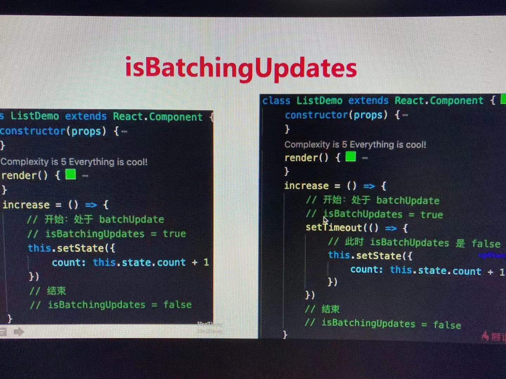
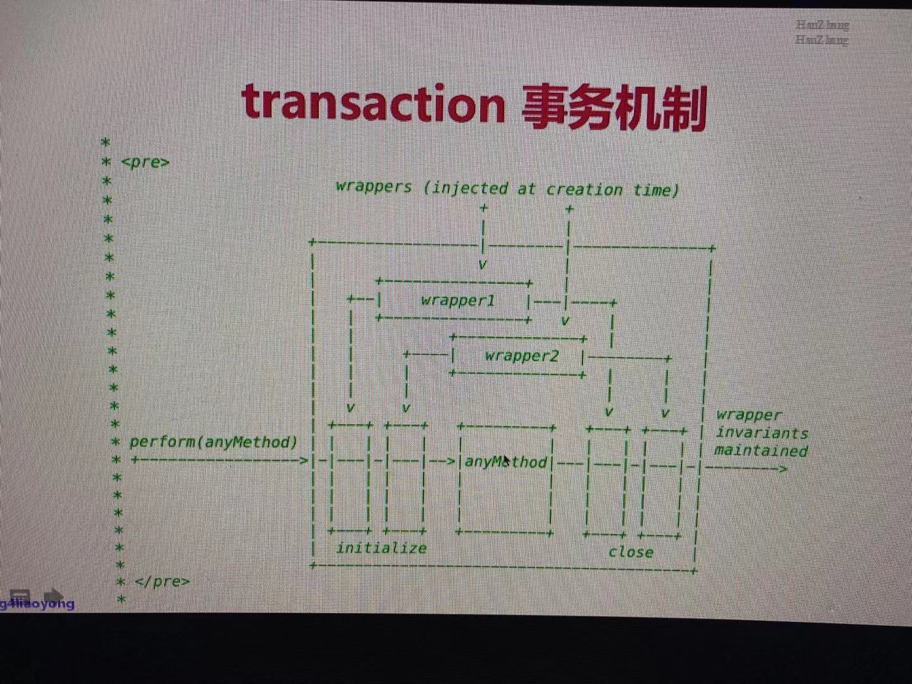
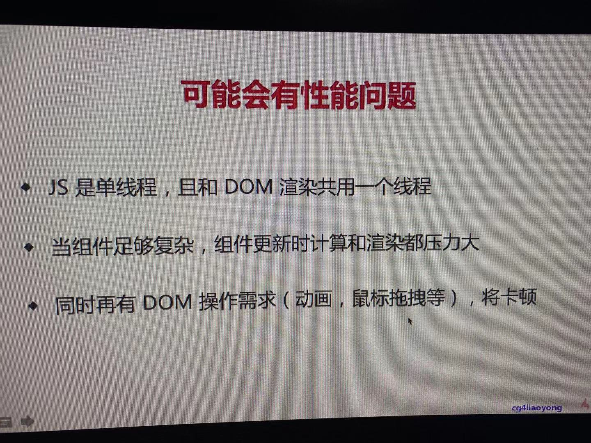

## setState 和 batchUpdate

哪些能命中 batchUpdate 机制
- 生命周期（和它调用的函数）
- React 中注册的事件（和它调用的函数）
- React 可以 '管理' 的入口

哪些不能命中 batchUpdate 机制
- setTimeout setInterval 等 （和它调用的函数）
- 自定义的DOM事件（和它调用的函数）
- React "管不到" 的入口

  

batchUpdate 过程大概

  
  

## React transaction 事务机制
> 主要是为 batchUpdate服务

transaction 大致过程
  
  

该方式存在哪些问题?
  

如何解决？（通过fiber）
  

## React Fiber

 