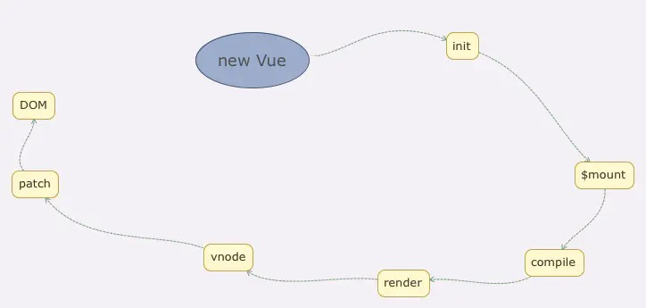
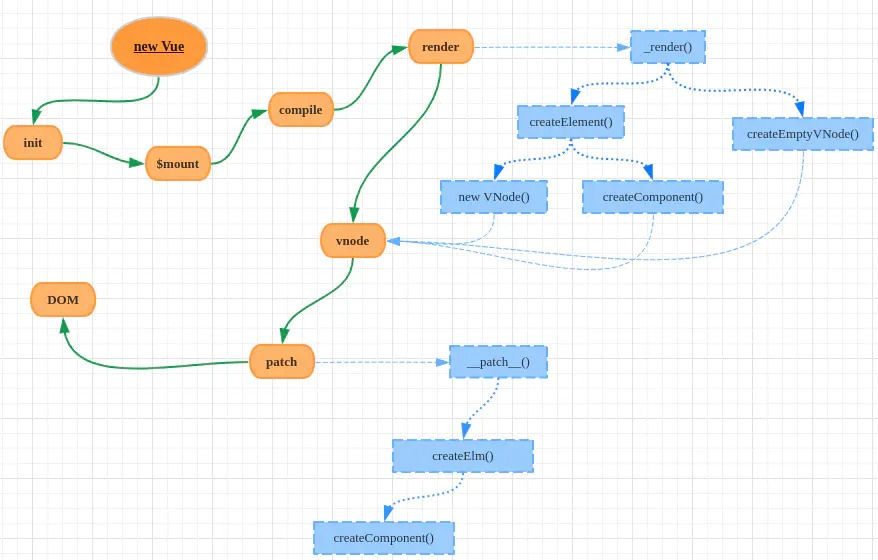

## 组件化和MVVM

## 响应式原理

> [!DANGER|style:flat]
- 由于数据劫持会递归调用data数据，如果存在循环引用会造成栈溢出，为此vue 对劫持过的数据 会标记 _ob 属性

## keep-alive 原理

> [!DANGER|style:flat]
- abstract: true ,保证keep-alive 的虚拟dom不会被渲染成真实dom
- keepAlive : true, 保证 keep-alive 包裹子组件的 mounted等生命周期会被跳过
- LRU 算法就是 单向链表结构 ， 最近活跃的会被作为链表头部，达到上限 删除链尾

## vnode 和 diff 算法

## 模板编译

## 组件渲染过程

## 前端路由

- hash 模式(hashChange)

- history 模式(popState)

## 参考链接

- [彻底揭秘keep-alive原理](https://juejin.cn/post/6844903837770203144)
- [前端路由简介以及vue-router实现原理](https://zhuanlan.zhihu.com/p/37730038)